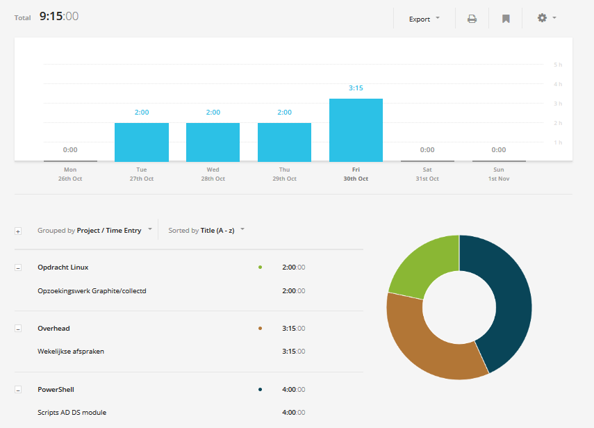

# Voortgangsrapport week 06

* Groep: g08
* Datum: 30/10/2015

| Student  | Aanw. | Opmerking |
| :---     | :---  | :---      |
| Vincent De Coen |       |           |
| Ruben Piro |       |           |
| Robbe Van Daele |       |           |
| Birgit Croux |       |           |
| Josey De Smet |      |            |

## Wat heb je deze week gerealiseerd?

### Algemeen

* Gewerkt aan automatisering AD
* Gewerkt aan installatie en configuratie Graphite

### Vincent De Coen

* Microsoft Virtual Academy
* Powershell automatisch script AD (niet gelukt)
* Powershell boek beginnen lezen (WMI)

![Afbeelding individueel rapport tijdregistratie] (/weekrapport/media/w06/week06Vincent.PNG "tijdregistratie individueel Vincent")

### Ruben Piro

* Powershell: Microsoft Virtual Academy module 5 - 6 - 7.
* Powershell: Powershell 3.0 First Steps Chapter 12 (Functions).
* Powershell: Powershell in practice: Getting started + Working with people (user accounts) [nog niet gedocumenteerd].
* Windows Server: beginscript(AD DHCP DNS zonder functies) + functies AD en DHCP + kleine cheatsheet
* Vervolledigen van de documentatie

![Afbeelding individueel rapport tijdregistratie] (/weekrapport/media/w06/week06Ruben.PNG "tijdregistratie individueel Ruben")

### Robbe Van Daele

* ...

[Afbeelding individueel rapport tijdregistratie]

### Birgit Croux

* Microsoft Virtual Academy: pipelines
* Oreilly Windows Powershell: interactive shell en pipelines
* Simple LAMP: installatie Graphite (nog niet afgewerkt)

### Josey De Smet

* Microsoft virtual academy
* Windows powershell 3.0 Step by Step : AD DNS : DomeinController
* Bijbenen linux; lamp/vagrant

## Wat plan je volgende week te doen?

### Algemeen

### Vincent De Coen
* Microsoft Virtual Academy uitkijken
* Powershell boek verder lezen
* Powershell scripting AD (testen)
* Linux LAMP stack testplan maken en testen

### Ruben Piro

* Microsoft Virtual Academy module 8 en 9
* Powershell 3.0 First Steps verder lezen (conclusie: veel beter boek gevonden als Manning powershell in practice)
* Werken aan het powershell script met de functies die moeten vervolledigd worden.

### Robbe Van Daele

### Birgit Croux

* Microsoft Virtual Academy les 2, 4, 5, 6
* Powershell fundamentals:
  - Variables and Objects
  - Looping and Flow Control
  - Strings and Unstructured Text
* Verderwerken aan installatie Graphite
* Testplan voor Powershell AD scripts 

### Josey De Smet
* Microsoft virtual Academy verder afwerken
* Powershell boek verder lezen
* Linux bijspringen collectd/graphite
## Waar hebben jullie nog problemen mee?

* ...
* ...

## Feedback technisch luik

### Algemeen

Zelfde opmerking!! Laatste kans!

Birgit heeft goed gewerkt aan Windows Powershell opdracht, volgt de afspraken en schreef een eerste samenvatting
Andere groepsleden krijgen verwittiging
volg de afspraken!
geen tijdsregistratie
geen documentatie van Powershell
geen beschrijving van werk in weekrapport
Paar kleine tips
Kwaliteit waarborgen door
teksten te laten nakijken door andere teamlid
testen beter voor te bereiden (afspreken wie wat wanneer zal testen en toevoegen aan scrum bord)
sneller te starten met testen (niet enkel o phet einde van de rit) en sneller inspelen op fouten
Scripts uit boeken en online repos bijhouden in folderstructuur (testen en bij onduidelijk commandos commentaar ### Vincent De Coen
Waarschuwing ### Ruben Piro
Waarschuwing ### Robbe Van Daele
Waarschuwing ### Birgit Croux ### Josey De Smet
Waarschuwing
### Vincent De Coen
### Ruben Piro
### Robbe Van Daele
### Birgit Croux
### Josey De Smet

## Feedback analyseluik

### Algemeen

### Vincent De Coen
### Ruben Piro
### Robbe Van Daele
### Birgit Croux
### Josey De Smet
